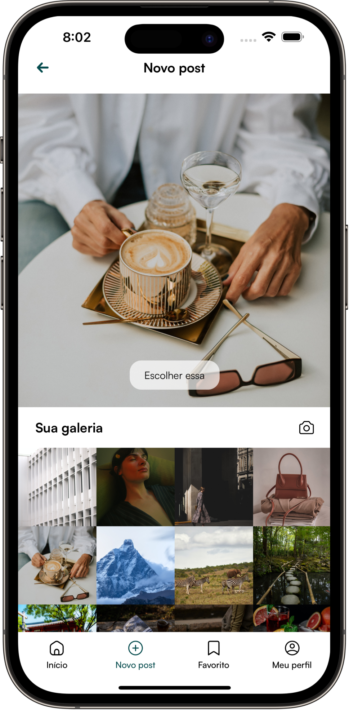
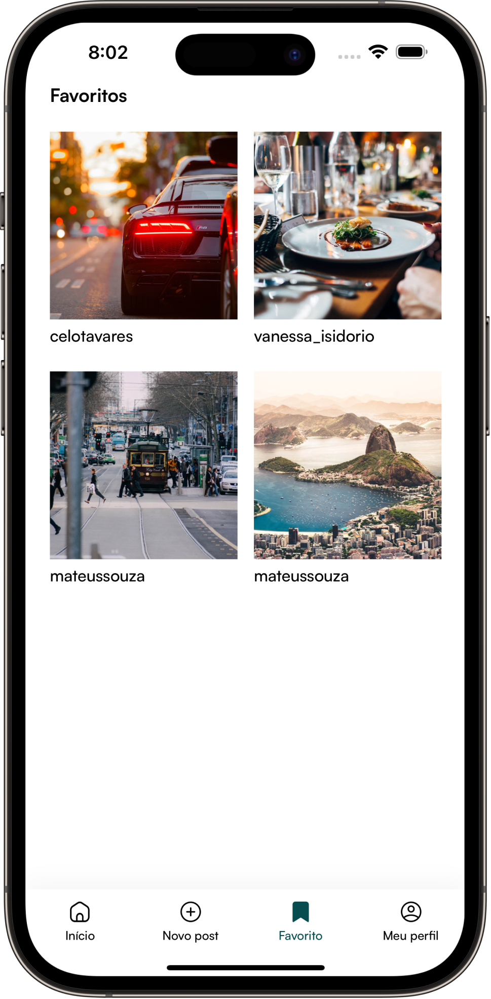
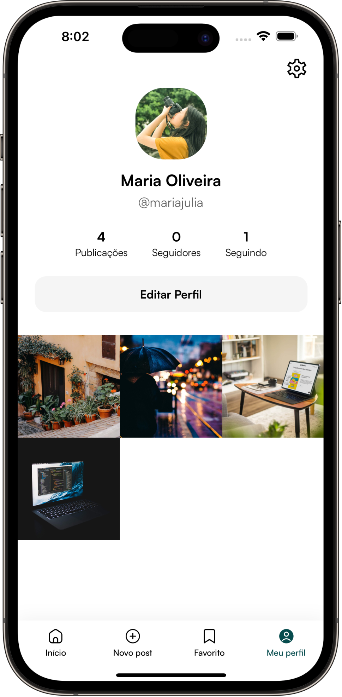
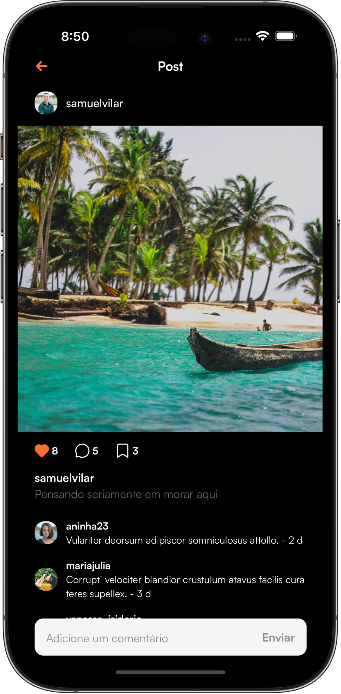
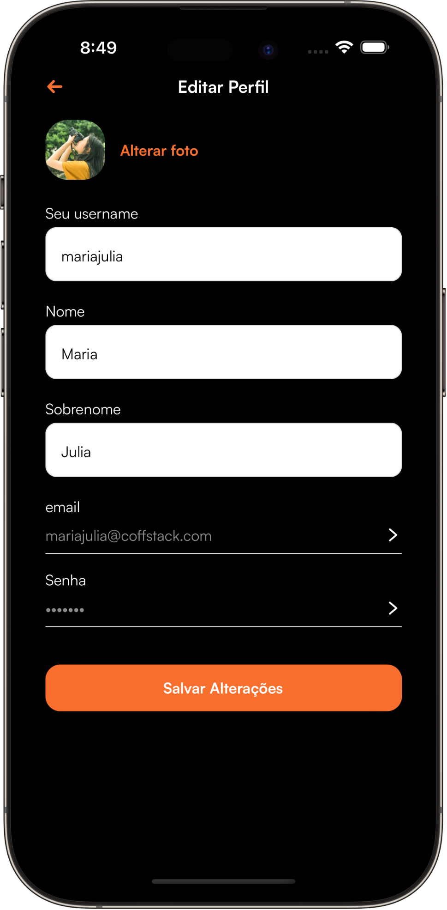
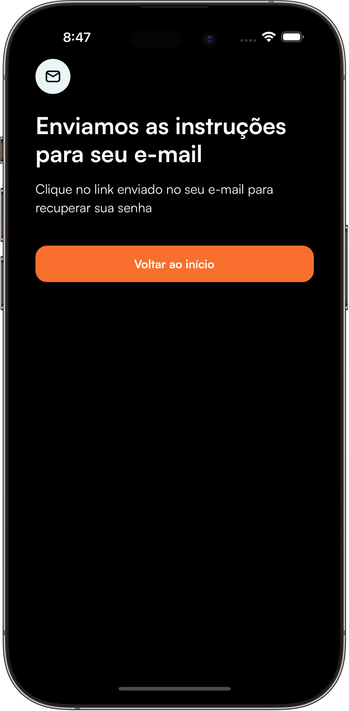
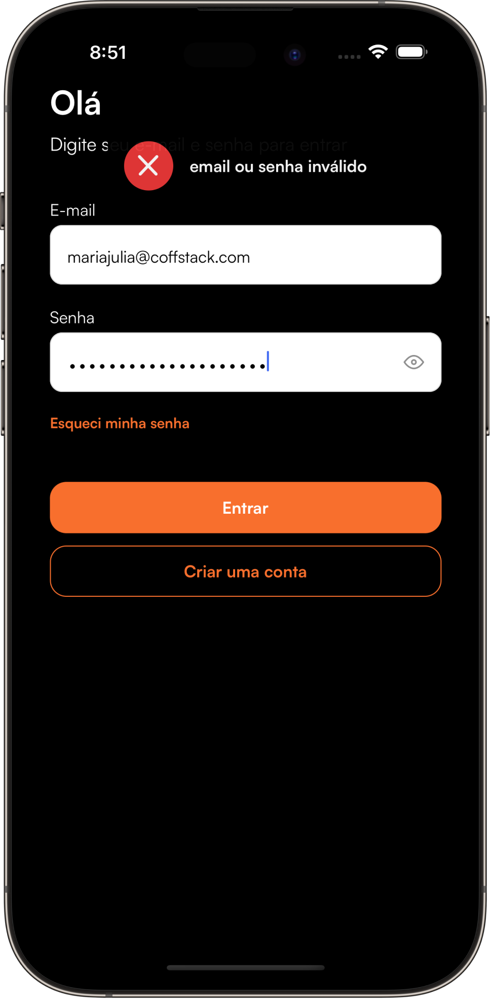

# 📱 Nubble App

O Nubble App é um projeto desenvolvido em React Native com foco em arquitetura escalável, boas práticas de desenvolvimento mobile e integração com serviços modernos do ecossistema JavaScript/TypeScript.

Este projeto está sendo utilizado como ambiente de estudo e evolução profissional, permitindo a aplicação prática de conceitos avançados de desenvolvimento mobile, testes automatizados, gerenciamento de estado, arquitetura de software e integração contínua.

Além de servir como laboratório para aprendizado, o objetivo é construir uma base sólida que represente padrões utilizados em aplicações reais de mercado.

---

## 🚀 Objetivos do Projeto

* Aprimorar conhecimentos em React Native.
* Aplicar conceitos de Clean Architecture e SOLID.
* Utilizar TypeScript em larga escala.
* Desenvolver interfaces reutilizáveis e escaláveis.
* Implementar testes automatizados.
* Trabalhar com integração contínua (CI/CD).
* Explorar integrações com câmera, notificações e armazenamento local.
* Consolidar conhecimentos para desenvolvimento de aplicações mobile profissionais.

---

## 📸 Screenshots

|                               |                               |                               |                               |
| :---------------------------: | :---------------------------: | :---------------------------: | :---------------------------: |
|  |  |  |  |
|  |  |  |  |

---

## 🛠️ Tecnologias e Bibliotecas

### Mobile

* React Native CLI
* TypeScript
* React Navigation
* React Native Vision Camera
* React Native MMKV
* React Native Permissions
* React Native Firebase
* React Native SVG
* React Native Safe Area Context

### Gerenciamento de Estado e Dados

* Zustand
* TanStack Query (React Query)
* Axios

### Formulários e Validação

* React Hook Form
* Zod

### UI e Design System

* Shopify Restyle

### Testes

* Jest
* React Native Testing Library

### Qualidade de Código

* ESLint
* Prettier
* Husky

### DevOps

* GitHub Actions
* Fastlane

---

## 🏗️ Arquitetura

O projeto segue uma arquitetura baseada em princípios de:

* Clean Architecture
* SOLID
* Separation of Concerns
* MVVM (Model-View-ViewModel)
* Design Patterns

O objetivo é manter uma estrutura escalável, testável e de fácil manutenção.

---

## 📚 Aprendizados

Este repositório é utilizado para documentar e praticar conceitos relacionados a:

* Desenvolvimento Mobile Profissional
* Arquitetura de Software
* Testes Automatizados
* Integração com APIs
* Gerenciamento de Estado
* Performance em React Native
* CI/CD para aplicativos mobile
* Publicação em lojas (Google Play e App Store)

---

## 🎯 Roadmap

* [ ] Autenticação
* [ ] Cadastro de usuários
* [ ] Perfil
* [ ] Upload de imagens
* [ ] Integração com notificações push
* [ ] Testes automatizados
* [ ] Pipeline CI/CD
* [ ] Publicação Android
* [ ] Publicação iOS

---

## 👨‍💻 Autor

**Gabriel J.**

Desenvolvedor Mobile especializado em React Native, TypeScript e JavaScript.

- [LinkedIn](https://www.linkedin.com/in/gabriel--jesus/en/)
- [GitHub](https://github.com/Gabriel-Jesusvix)

---

## 📄 Licença

Este projeto é destinado para estudos, aprendizado e evolução profissional.
